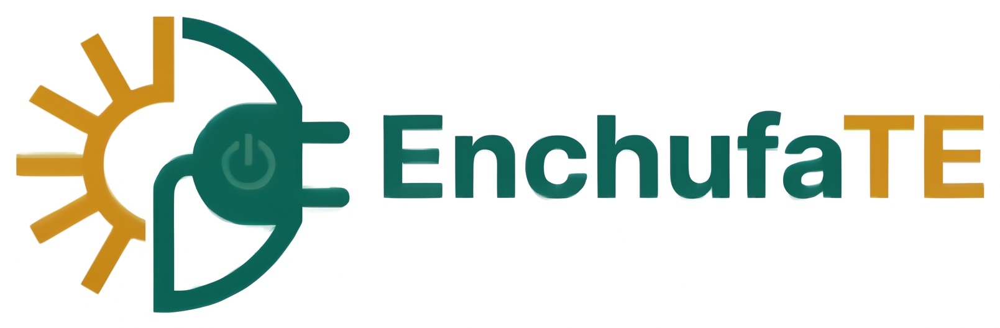

<p align="center">
  
</p>

<p align="center">
  <a href="https://tinyurl.com/Hacaithon" target="_blank"></a>
  
  
  
</p>

<p align="center">
  <b>Equipo 11 · HaCAiThon 2026</b> — Temática: Energía Renovable y Electrificación Rural
</p>

---

## ¿Qué es EnchufaTE?

**EnchufaTE** es una aplicación web que le dice a una familia, posta rural, escuela o predio agrícola de una zona aislada de Chile **exactamente qué sistema solar/eólico off-grid necesita, cuánto cuesta, qué comprar y dónde instalarlo** — sin depender de un ingeniero para hacer una primera estimación seria.

El usuario recorre un asistente de 5 pasos:

1. **📍 Ubicación** — Escribe una dirección o hace clic en un mapa. La app resuelve automáticamente la región/comuna y consulta radiación solar y viento reales del lugar (Open-Meteo, con respaldo offline por región chilena si no hay internet).
2. **🏠 Detalles del proyecto** — Cuántas personas, cuántas viviendas/instalaciones (no solo personas — sirve para un caserío completo, no solo una casa) y qué electrodomésticos van a usar, con consumos reales típicos (Wh según potencia y horas de uso).
3. **⚡ Cálculo** — El motor evalúa **3 configuraciones completas** (Económica, Recomendada, Resiliente), cada una con su inversión total, cantidad de paneles/baterías/turbina, y un desglose de qué comprar con enlaces de referencia y dónde contratar la instalación.
4. **🗺️ Plano de instalación** — Un mapa muestra dónde debería ir cada componente (paneles, turbina, baterías) respecto a la(s) vivienda(s), con distancia y orientación recomendadas.
5. **📄 Expediente TE1 SEC** — Memoria de cálculo, diagrama unilineal y checklist normativo listos para imprimir/adjuntar a la declaración ante la SEC.

---

## Cómo correrlo

**Requisitos:** Python 3.10+.

```bash
# 1. Instalar dependencias
pip install -r backend/requirements.txt

# 2. Iniciar el servidor (sirve el backend y el frontend juntos)
python backend/run.py
```

Abre **http://localhost:8000** en el navegador (no abras `frontend/index.html` directamente como archivo — la app necesita conectarse a `http://localhost:8000` para pedir datos climáticos y calcular el dimensionamiento).

- Documentación interactiva de la API: http://localhost:8000/docs
- Documentación alternativa (ReDoc): http://localhost:8000/redoc

Alternativa equivalente con uvicorn directo:
```bash
uvicorn app.main:app --app-dir backend --host 0.0.0.0 --port 8000 --reload
```

### Ejecutar las pruebas automatizadas

```bash
PYTEST_DISABLE_PLUGIN_AUTOLOAD=1 pytest -p asyncio
```

---

## Regulación: qué valida EnchufaTE

Chile exige que toda instalación eléctrica de autogeneración (con o sin inyección a la red) se declare ante la **Superintendencia de Electricidad y Combustibles (SEC)**. EnchufaTE dimensiona el sistema siguiendo los criterios técnicos de:

- **RIC N°09.1/2021** (Sistemas de Autogeneración y Aislados): segregación de canalizaciones DC/AC, seccionador DC bajo carga, descargadores de sobretensión (DPS) Tipo II en DC y AC, protección diferencial Tipo A superinmunizado o Tipo B, y rotulación de advertencia obligatoria.
- **RIC N°06/2021** (Puesta a tierra): resistencia de puesta a tierra ≤ 20 Ω con unión equipotencial de todas las estructuras metálicas.
- **Declaración TE1**: memoria de cálculo, diagrama unilineal, plano de disposición física, y certificación del instalador (Clase A o B).

El **Paso 5 (Expediente TE1 SEC)** de la app genera el checklist y la memoria de cálculo listos para adjuntar. Esto es una **ayuda de dimensionamiento y no reemplaza a un instalador eléctrico certificado SEC** — la declaración oficial y la ejecución de la obra siempre deben quedar en manos de un profesional habilitado.

---

## Estructura del código

```text
├── backend/
│   ├── app/
│   │   ├── api/endpoints.py         # Endpoints REST (/dimensionar, /clima, /geocode/*, /catalogo, /presets, /regiones)
│   │   ├── core/
│   │   │   ├── weather.py           # Open-Meteo API + respaldo offline por región de Chile
│   │   │   ├── demand.py            # Demanda por habitantes, viviendas y artefactos
│   │   │   ├── sizing.py            # Motor de dimensionamiento (Solar, Eólico, LiFePO4, Inversor)
│   │   │   ├── economics.py         # Costos CLP, BOM con enlaces de compra, LCOE, payback, CO2
│   │   │   ├── sec_compliance.py    # Checklist normativo SEC RIC N°09.1 y RIC N°06
│   │   │   ├── layout.py            # Emplazamiento físico (Solar/Eólico/Baterías) vs. vivienda(s)
│   │   │   └── geocoding.py         # Proxy de geocodificación (evita bloqueos de referer del navegador)
│   │   ├── models/schemas.py        # Modelos Pydantic
│   │   ├── models/catalog.py        # Catálogo de electrodomésticos y presets
│   │   ├── config.py                # Constantes técnicas, de mercado y climáticas
│   │   └── main.py                  # Servidor FastAPI, sirve también el frontend estático
│   ├── tests/                       # Suite de tests unitarios y de integración
│   ├── requirements.txt
│   └── run.py
├── frontend/
│   ├── index.html                   # Asistente de 5 pasos
│   ├── styles.css                   # Sistema de diseño (tema claro, paleta de marca)
│   ├── app.js                       # Lógica del asistente, mapas y llamadas a la API
│   └── assets/logo_enchufate.png    # Logo del proyecto
├── CLAUDE.md                        # Guía de desarrollo y convenciones del proyecto
├── instrucciones_desarrollo_ia.md   # Especificación técnica para agentes de IA
└── LICENSE                          # Licencia MIT
```

---

## Créditos y desarrollo con IA

Proyecto desarrollado por el **Equipo 11** para la **HaCAiThon 2026** del Centro de Alumnos de Ingeniería UC (CAi). Licencia MIT (código abierto).

**Este código fue desarrollado con asistencia de Inteligencia Artificial**, usando:

- **Claude** (Anthropic) — vía Claude Code.
- **Google Antigravity / Gemini** (Google) — plataforma de desarrollo agéntico impulsada por modelos Gemini.

El uso de estas herramientas de IA se declara explícitamente por transparencia con el jurado y la comunidad de la HaCAiThon 2026.
